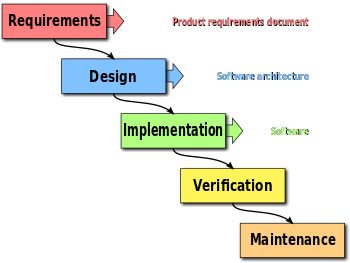

# Waterfall model
Typically, many real-world (software development) projects
are divided into different phases, where each phase depends on the
output of the previous phase. We refer to this as the 'waterfall model',
because each phase flows into the next phase like a waterfall:

The key is that there is a clear project timeline and agreed-upon deliverables
at the beginning of the project.

> ## Discussion
> What do you think are potential drawbacks of the waterfall model?
>
> > ## Solution
> > - Less customer involvement (only in the beginning)
> > - Users usually only really know the requirements once they have working software, but then it is too late.
> > - No way to know upfront what difficulties you might face
> > - Testing happens only at the very end
> > - Deadlines are often not met, in practice waterfall projects are delayed a lot
> > - Only at the very end of the project there is working software, if you do not reach the end you do not have working software.
> {: .solution}
{: .challenge}

# Agile manifesto
The Agile way of working contrasts the Waterfall model and mitigates most of its drawbacks.
Watch [this video introducing the agile manifesto](http://growingagile.thinkific.com/courses/take/scrumbasics/lessons/967803-agile-manifesto-lesson).

> ## Exercise
> These are the [12 principles behind the agile manifesto](http://agilemanifesto.org/principles.html). Which of these
> resonates the most for you?
> 1. Our highest priority is to satisfy the customer through early and continuous delivery of valuable software.
> 2. Welcome changing requirements, even late in development. Agile processes harness change for the customer's competitive advantage.
> 3. Deliver working software frequently, from a couple of weeks to a couple of months, with a preference to the shorter timescale.
> 4. Business people and developers must work together daily throughout the project.
> 5. Build projects around motivated individuals. Give them the environment and support they need, and trust them to get the job done.
> 6. The most efficient and effective method of conveying information to and within a development team is face-to-face conversation.
> 7. Working software is the primary measure of progress.
> 8. Agile processes promote sustainable development. The sponsors, developers, and users should be able to maintain a constant pace indefinitely.
> 9. Continuous attention to technical excellence and good design enhances agility.
> 10. Simplicity--the art of maximizing the amount of work not done--is essential.
> 11. The best architectures, requirements, and designs emerge from self-organizing teams.
> 12. At regular intervals, the team reflects on how to become more effective, then tunes and adjusts its behavior accordingly.
{: .challenge}

> ## Discussion
> Think about following the agile manifesto when working on your projects in a team.
> - What are benefits?
> - What are downsides?
>
> > ## Solution
> > ### Benefits:
> > - Because the focus is on product quality, you will build better products
> > - By incorporating users/customers you bring more value to them.
> > - Because of iterative reflective process, the team process keeps on improving.
> > - Reduced risk of failing projects
> > - Very flexible, changes are introduced easily (normally this can be time-consuming)
> > - There is trust in the team and its self-organisation, which boosts morale of the team.
> > - By supporting motivated individuals and accommodating to what they need, they will keep motivated.
> >
> > ### Downsides:
> > - Lack of clear structure can make it easy to get side-tracked
> > - Because of incremental nature it is hard to say when something is done.
> > - You need a high level of collaboration that is hard to maintain
> {: .solution}
{: .challenge}

> ## Disclaimer to comparison with waterfall model
> It is good to note that the comparison of the agile movement with the waterfall model
> is a bit artificial. Agile methodologies are often framed as **the** way of solving waterfall model pitfalls,
> but there have been modifications of the 'pure' waterfall model that accommodate
> these pitfalls too. In fact they are not mutually exclusive, and you could apply
> principle 12 by picking aspects from the waterfall model to continuously improve your teams process.
{: .callout}

